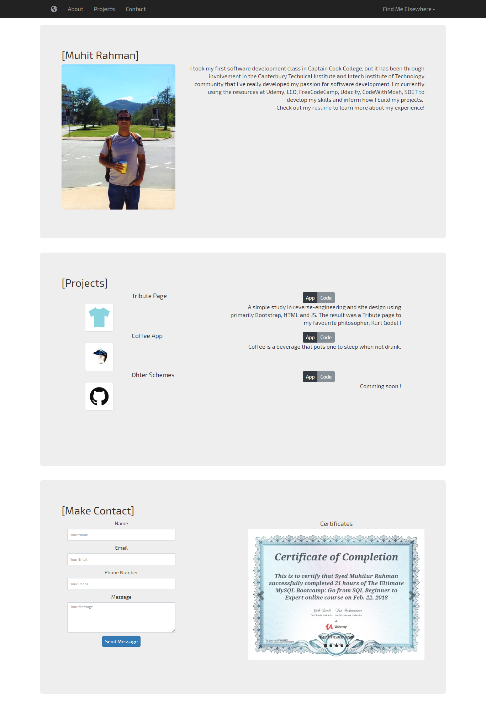

# portfolio


## programming
HTML, CSS, JS, JQuery, Bootstrap 

## uses

I have used latest libraries, bootstrap, cdn, ajax, fontawesome, googlefont, jquery, js, html, css here to create template, styling, functionality and user interface.

```bash
index.html
portfolio.css
script.js
```

## ask me
Pull requests are welcome. For major changes, please open an issue first to discuss what you would like to change.

Please make sure to push back to repository as appropriate.

## License
numberS info guild (nig)
